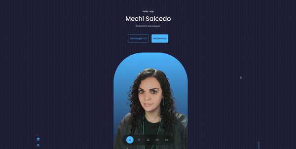

<a name="readme-top"></a>
[![Contributors][contributors-shield]][contributors-url]
[![Issues][issues-shield]][issues-url]

<!-- PROJECT LOGO -->
<br />
<div align="center">
  <a href="https://github.com/Merssith/portfolio">
    
  </a>

<h3 align="center">PORTFOLIO</h3>

  <p align="center">
    <br />
    <a href="https://www.mechisalcedo.com"><strong>Browse the site »</strong></a>
    <br />
    <a href="https://github.com/Merssith/portfolio"><strong>Explore the docs »</strong></a>
    <br />
    <a href="https://github.com/Merssith/portfolio/issues">Report bug</a>
    ·
    <a href="https://github.com/Merssith/portfolio/issues">Request feature</a>
  </p>
</div>

<!-- TABLE OF CONTENTS -->
<details>
  <summary>Table of Contents</summary>
  <ol>
    <li>
      <a href="#about-the-proyect">About The Project</a>
      <ul>
        <li><a href="#built-with">Built With</a></li>
      </ul>
    </li>
    <li>
      <a href="#getting-started">Getting Started</a>
      <ul>
        <li><a href="#installation">Installation</a></li>
      </ul>
    </li>
    <li><a href="#roadmap">Roadmap</a></li>
    <li><a href="#contributing">Contributing</a></li>
    <li><a href="#contact">Contact</a></li>
  </ol>
</details>

<!-- ABOUT THE PROJECT -->

## About The Proyect

<!-- <p align="center"></p> -->

This is my personal portfolio. I hope you like it :) 

<p align="right">(<a href="#readme-top">back to top</a>)</p>

### Built With

- React
- React Icons
- EmailJs
- SwiperJs

<p align="right">(<a href="#readme-top">back to top</a>)</p>

<!-- GETTING STARTED -->

## Getting Started

### Installation

1. Clone the repo
   ```sh
   git clone https://github.com/Merssith/portfolio.git
   ```
2. Install NPM packages
   ```sh
   npm install
   ```
3. Generate the .env file, using as a base the example found in this repository
4. Run the app (for testing)
   ```sh
   npm run dev
   ```

<p align="right">(<a href="#readme-top">back to top</a>)</p>

<!-- ROADMAP -->

## Roadmap

- [x] V.0
  - [x] About Me
  - [x] Experience
  - [x] Stack
  - [x] Portfolio
  - [x] Testimonials
  - [x] Contact
- [ ] V.1 (Comming Soon)
  - [ ] LinkedIn Integration for testimonials
  - [ ] English version

<p align="right">(<a href="#readme-top">back to top</a>)</p>

<!-- CONTRIBUTING -->

## Contributing

<p>Contributions from the Dev community help us learn, be inspired, and create new things! All contributions are welcome!</p>
<p>If you have any suggestions to improve our project, please fork the repository and create a pull request. Or You can open an issue.</p>
<p>Thanks again!</p>

1. Fork the Project
2. Create your Feature Branch (`git checkout -b feature/MyFeature`)
3. Commit your Changes (`git commit -m 'Add MyFeature'`)
4. Push to the Branch (`git push origin feature/MyFeature`)
5. Open a Pull Request

<p align="right">(<a href="#readme-top">back to top</a>)</p>

<!-- CONTACT -->

## Contact

- Mercedes Salcedo » [Email](mailto:mercedes.salcedo1989@gmail.com) - [LinkedIn](https://www.linkedin.com/in/mercedessalcedojobs/)

Project Link: [https://github.com/Merssith/portfolio](https://github.com/Merssith/portfolio)

<p align="right">(<a href="#readme-top">back to top</a>)</p>

[contributors-shield]: https://img.shields.io/github/contributors/Merssith/portfolio.svg?style=for-the-badge
[contributors-url]: https://github.com/Merssith/portfolio/graphs/contributors
[issues-shield]: https://img.shields.io/github/issues/Merssith/portfolio.svg?style=for-the-badge
[issues-url]: https://github.com/Merssith/portfolio/issues
